# hello_world

A new Flutter project.
# Tugas 1 dan 2

### Jobsheet 5 Praktikum 1

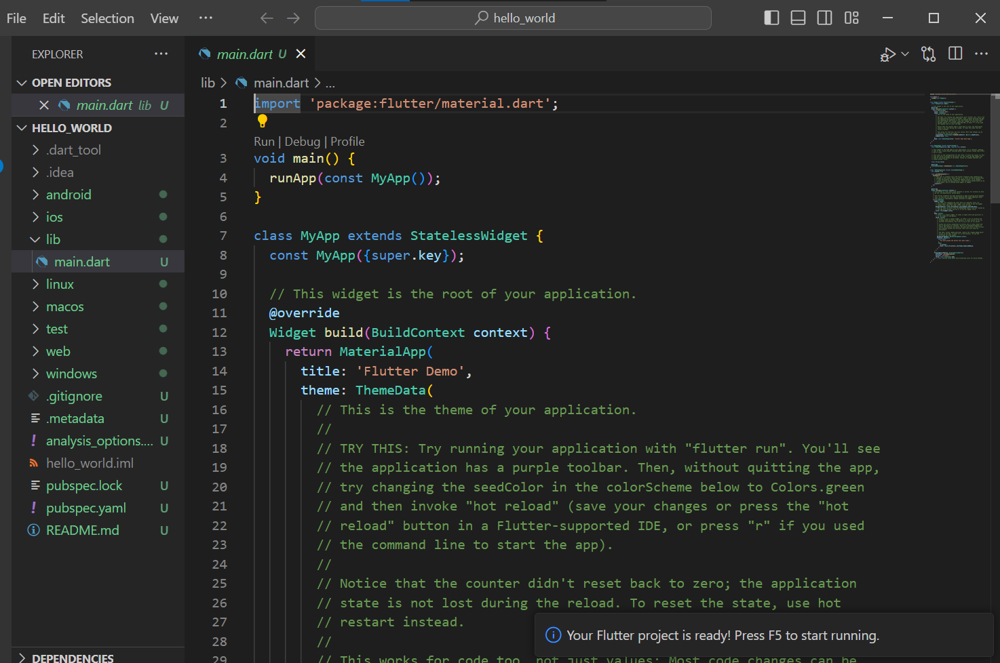
### Jobsheet 5 Praktikum 2

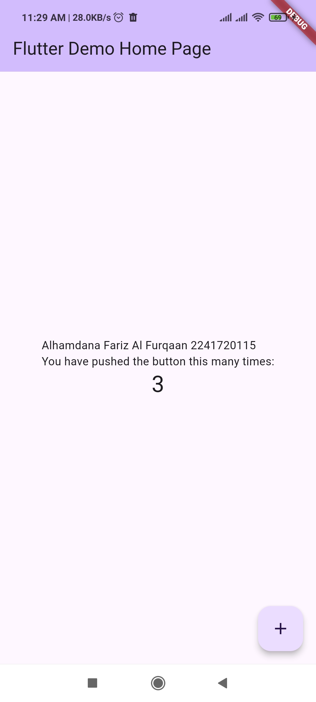
### Jobsheet 5 Praktikum 3

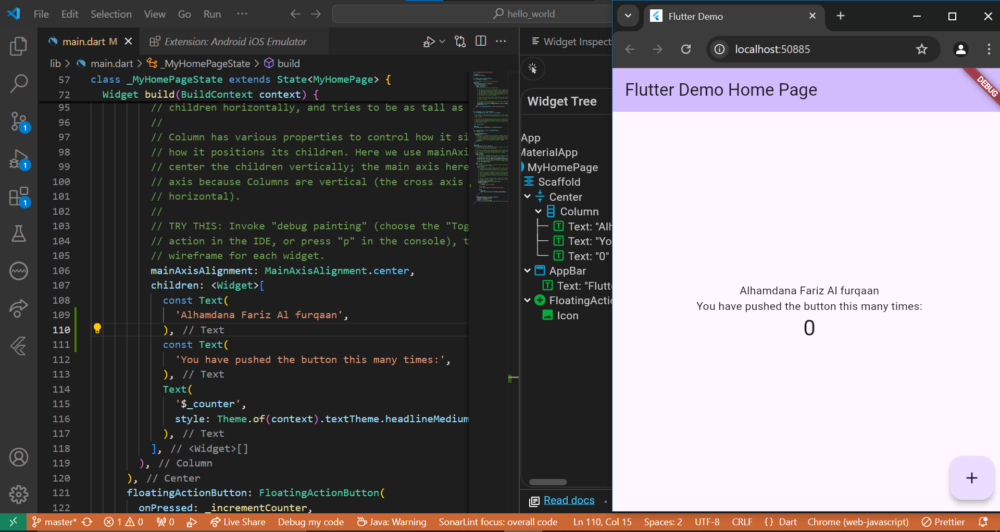
### Jobsheet 5 Praktikum 4

#### Langkah 1
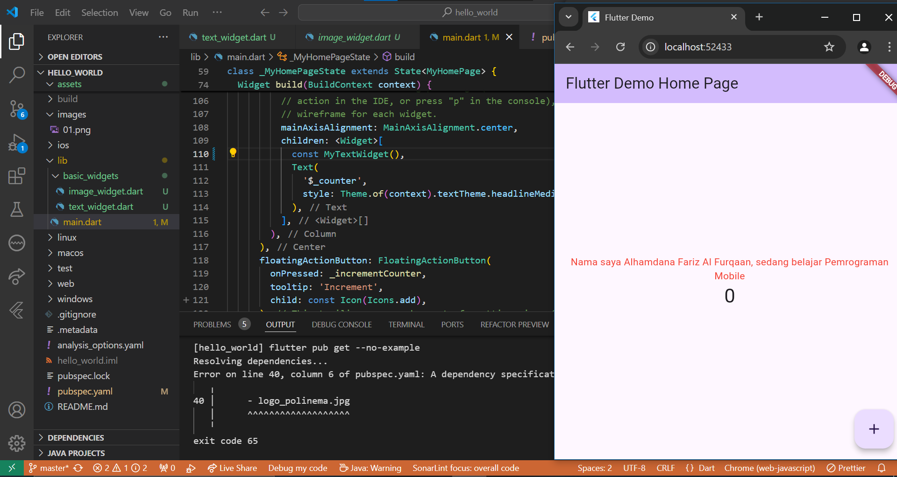
#### Langkah 2

### Jobsheet 5 Praktikum 5

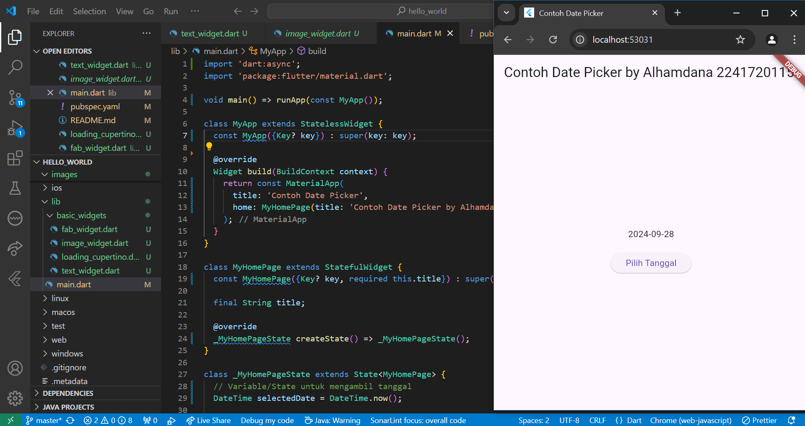

# Tugas 3
### Langkah 3
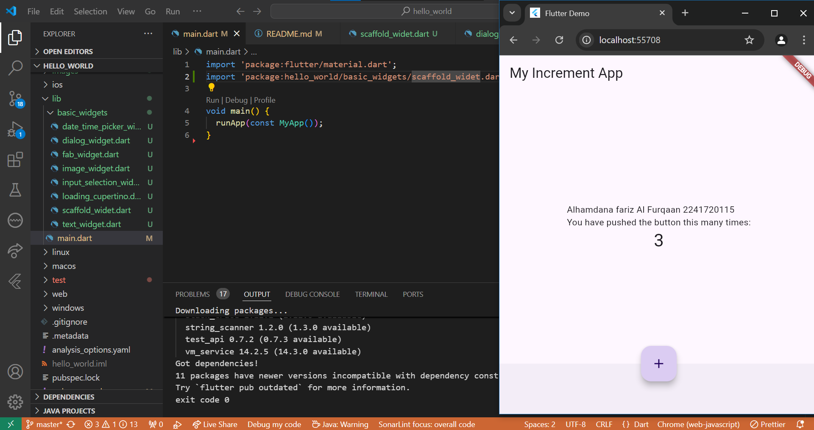
### Langkah 4
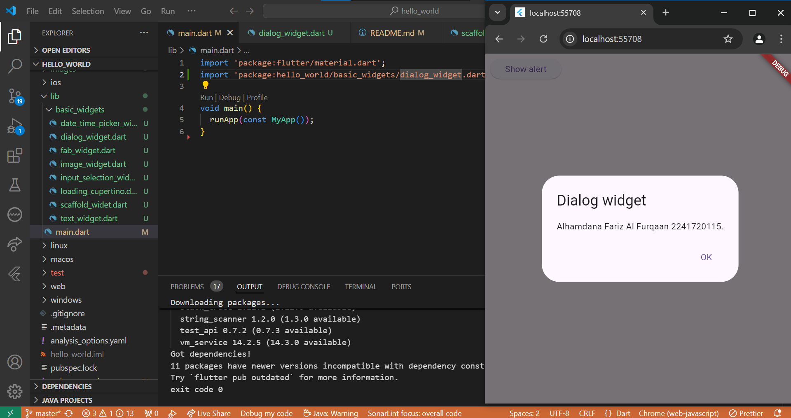
### Langkah 5
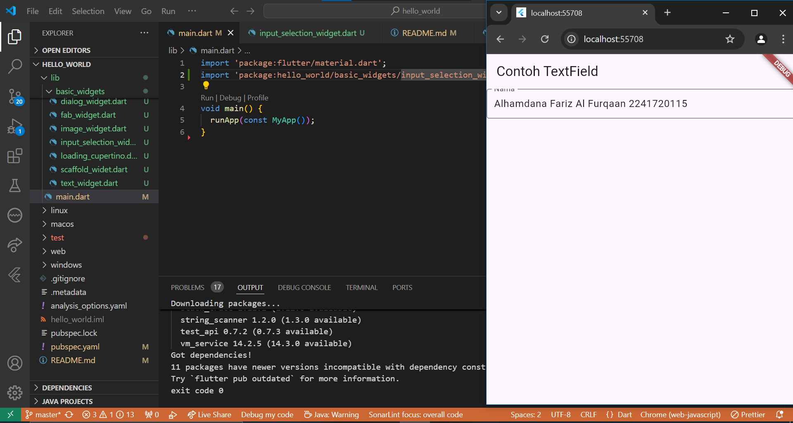
### Langkah 6
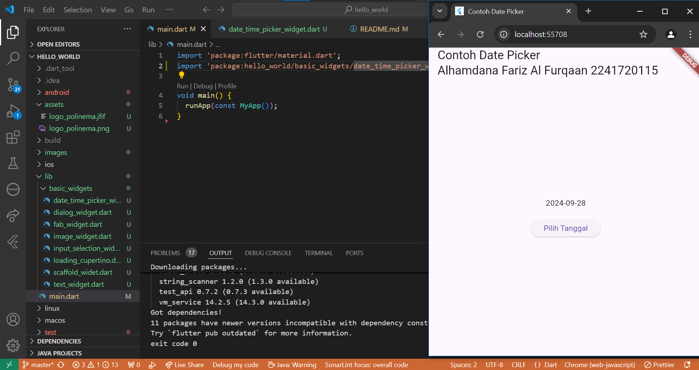

# Tugas 4
### Langkah 3
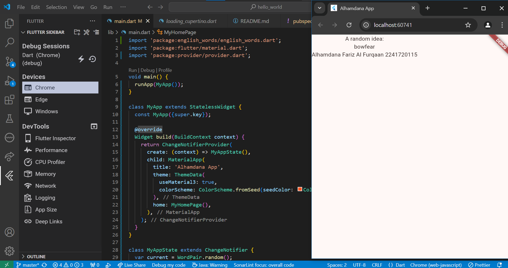
### Langkah 4
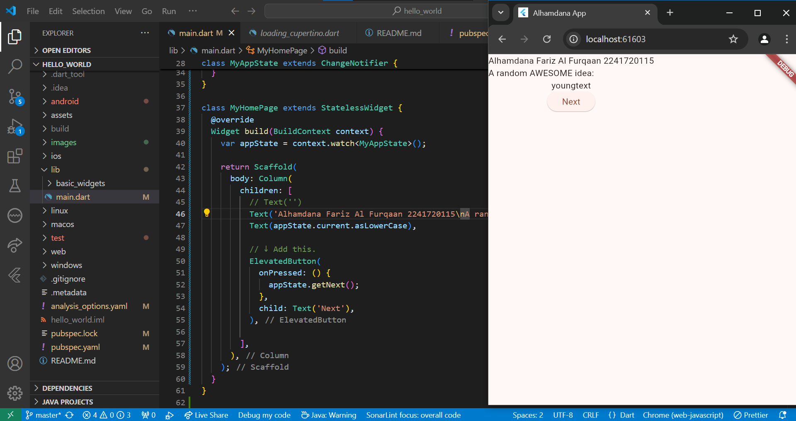
### Langkah 5
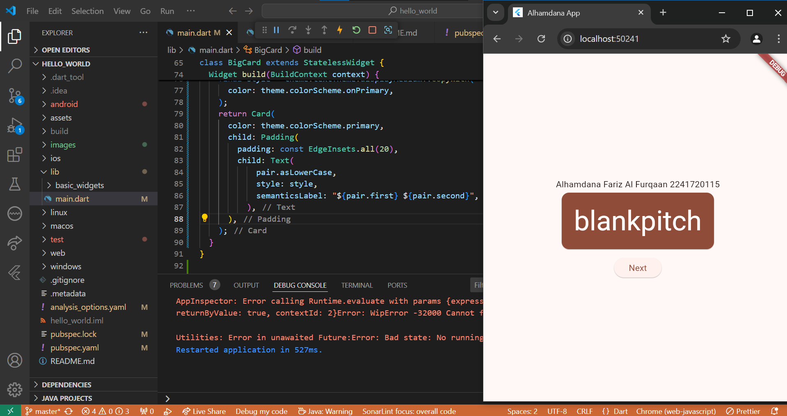
### Langkah 6
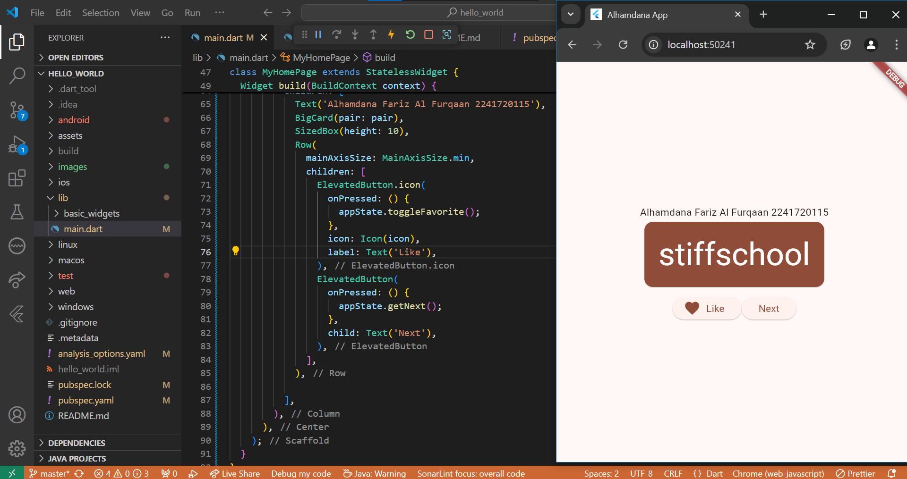
### Langkah 7
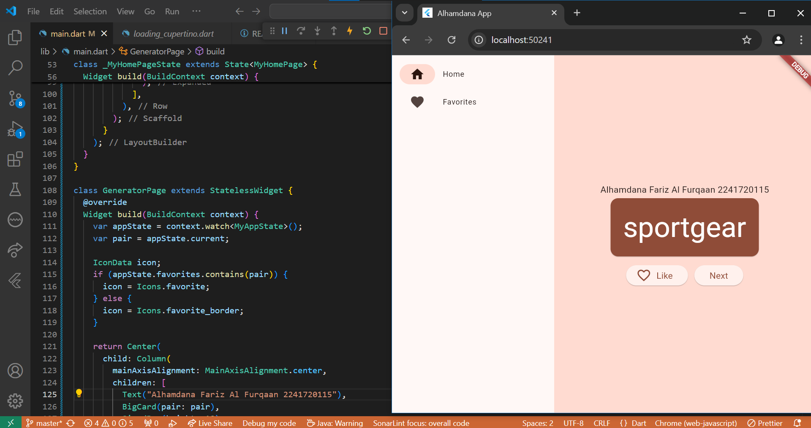
### Langkah 8
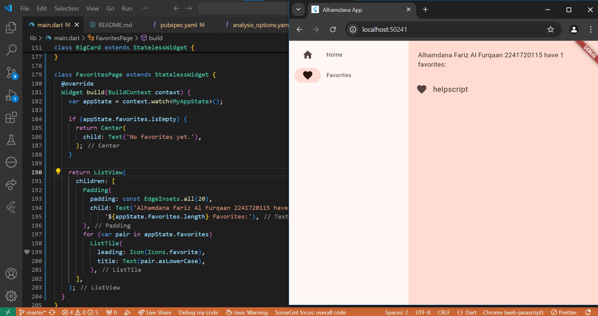